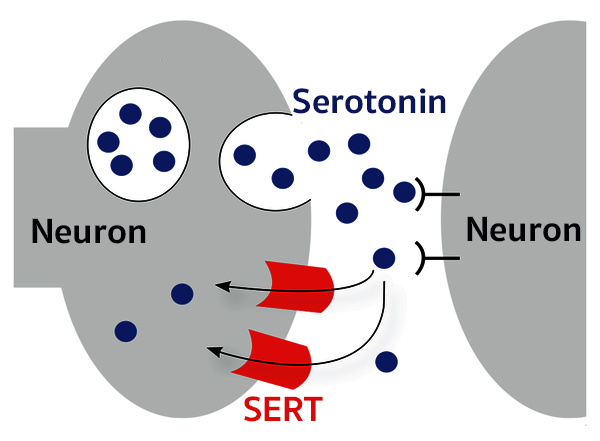

### Project status: ON GOING

# Cheminformatics - SERT exploratory analysis project

## Overview

The serotonin transporter (SERT) is a protein that transports the neurotransmitter serotonin from the synaptic cleft back into the presynaptic neuron. Inhibitors of SERT block this reuptake, increasing serotonin levels in the synaptic cleft. This makes SERT inhibitors interesting therapeutic targets for a variety of disorders, including depression, anxiety, and obsessive-compulsive disorder.

In this project I performed exploratory analysis on SERT ligand dataset from CheMBL using data science methodologies.

## 1. Setup

Python libraries used:

- Pandas
- RDkit
- datamol
- Numpy
- Sklearn
- Seaborn
- Matplotlib
- Pickle
- Pycm

you can install all this libraries on your personal python env or use colab to run the notebook.

## 2. Inputs

The complete data set for MAO-A was obtained from ChemMBL can be found here:

[SERT data set](https://www.ebi.ac.uk/chembl/target_report_card/CHEMBL228/)

